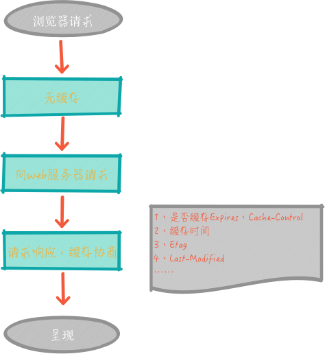
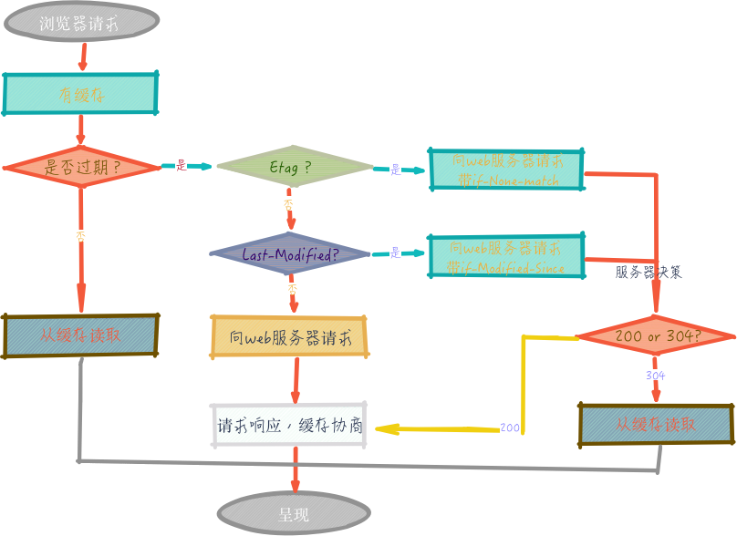
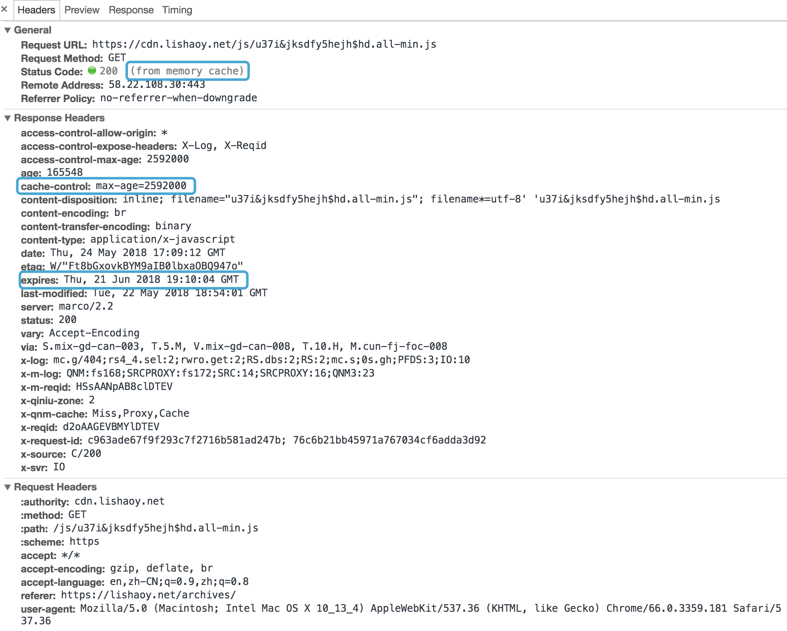

### 压缩 合并
对于 前端性能优化 自然要关注 首屏 打开速度，而这个速度，很大因素是花费在网络请求上，那么怎么减少网络请求的时间呢？

1. 减少网络请求次数

2. 减小文件体积

3. 使用 CDN 加速

所以压缩、合并就是一个解决方案，当然可以用 gulp 、 webpack 、 grunt 等构建工具压缩、合并。

**JS、CSS 压缩、合并**

然后，再把 压缩、合并 的 JS、CSS 放入 CDN

**图片压缩、合并**
```
//压缩image

gulp.task('imagemin', function () {
    gulp.src('./public/**/*.{png,jpg,gif,ico,jpeg}')
        .pipe(imagemin())
        .pipe(gulp.dest('./public'));
});
```

图片的合并可以采用` CSSSpirite `，方法就是把一些小图用 PS 合成一张图，用 css 定位显示每张图片的位置。

**` 压缩、合并 （js、css、img） 再放入 CDN`**

## 雅虎军规
1. 尽量减少 HTTP 请求个数——须权衡

2. 使用 CDN（内容分发网络）

3. 为文件头指定 Expires 或 Cache-Control ，使内容具有缓存性。

4. 避免空的 src 和 href

5. 使用 gzip 压缩内容

6. 把 CSS 放到顶部

7. 把 JS 放到底部

8. 避免使用 CSS 表达式

9. 将 CSS 和 JS 放到外部文件中

10. 减少 DNS 查找次数

11. 精简 CSS 和 JS

12. 避免跳转

13. 剔除重复的 JS 和 CSS

14. 配置 ETags

15. 使 AJAX 可缓存

16. 尽早刷新输出缓冲

17. 使用 GET 来完成 AJAX 请求

18. 延迟加载

19. 预加载

20. 减少 DOM 元素个数

21. 根据域名划分页面内容

22. 尽量减少 iframe 的个数

23. 避免 404

24. 减少 Cookie 的大小

25. 使用无 cookie 的域

26. 减少 DOM 访问

27. 开发智能事件处理程序

28. 用 代替 @import

29. 避免使用滤镜

30. 优化图像

31. 优化 CSS Spirite

32. 不要在 HTML 中缩放图像——须权衡

33. favicon.ico要小而且可缓存

34. 保持单个内容小于25K

35. 打包组件成复合文本

## 缓存

缓存会根据请求保存输出内容的副本，例如 页面、图片、文件，当下一个请求来到的时候:如果是相同的URL，缓存直接使 用本地的副本响应访问请求，而不是向源服务器再次发送请求。因此，可以从以下 2 个方面提升性能。

- 减少相应延迟，提升响应时间
- 减少网络带宽消耗，节省流量
我们用两幅图来了解下浏览器的 缓存机制

### 浏览器第一次请求



### 浏览器再次请求



从以上两幅图中，可以清楚的了解浏览器` 缓存 `的过程。 首次访问一个 URL ，没有` 缓存 `，但是，服务器会响应一些` header `信息，如：`expires、cache-control、last-modified、etag `等，来记录下次请求是否缓存、如何缓存。 再次访问这个` URL `时候，浏览器会根据首次访问返回的` header `信息，来决策是否缓存、如何缓存。 我们重点来分析下第二幅图，其实是分两条线路，如下👇

- 第一条线路： 当浏览器再次访问某个` URL `时，会先获取资源的` header `信息，判断是否命中强缓存` （cache-control和expires） `，如命中，直接从缓存获取资源，包括响应的` header `信息 （请求不会和服务器通信） ，也就是` 强缓存 `, 如图


- **第二条线路**： 如没有命中` 强缓存 `，浏览器会发送请求到服务器，请求会携带第一次请求返回的有关缓存的` header `信息` （Last-Modified/If-Modified-Since和Etag/If-None-Match） `，由服务器根据请求中的相关` header `信息来比对结果是否协商缓存命中；若命中，则服务器返回新的响应` header `信息更新缓存中的对应` header `信息，但是并不返回资源内容，它会告知浏览器可以直接从缓存获取；否则返回最新的资源内容，也就是**` 协商缓存`**。

现在，我们了解到浏览器缓存机制分为 强缓存、协商缓存，再来看看他们的区别 👇


| 缓存策略 | 获取资源形式 | 状态码 | 发送请求到服务器 |
| :- | :-: | :- | :-: |
| 强缓存 | 从缓存取 | 200（from memory cache） | 否，直接从缓存取 |
| 协商缓存 | 从缓存取 | 304（not modified） | 是，通过服务器来告知缓存是否可用 |


## 强缓存
与强缓存相关的 header 字段有两个：

### **expires**
**expires**： 这是` http1.0 `时的规范，它的值为一个绝对时间的**GMT**格式的时间字符串，如` Mon, 10 Jun 2015 21:31:12 GMT `，如果发送请求的时间在` expires `之前，那么本地缓存始终有效，否则就会发送请求到服务器来获取资源

### cache-control
**cache-control**:` max-age=number `，这是` http1.1 `时出现的` header `信息，主要是利用该字段的` max-age `值来进行判断，它是一个相对值；资源第一次的请求时间和` Cache-Control `设定的有效期，计算出一个资源过期时间，再拿这个过期时间跟当前的请求时间比较，如果请求时间在过期时间之前，就能命中缓存，否则未命中，` cache-control `除了该字段外，还有下面几个比较常用的设置值：

- **no-cache**： 不使用本地缓存。需要使用缓存协商，先与服务器确认返回的响应是否被更改，如果之前的响应中存在 ETag ，那么请求的时候会与服务端验证，如果资源未被更改，则可以避免重新下载。
- **no-store**： 直接禁止游览器缓存数据，每次用户请求该资源，都会向服务器发送一个请求，每次都会下载完整的资源。
- **public**： 可以被所有的用户缓存，包括终端用户和 CDN 等中间代理服务器。
- **private**： 只能被终端用户的浏览器缓存，不允许 CDN 等中继缓存服务器对其缓存。

> **Tips**：如果 cache-control 与 expires 同时存在的话，cache-control 的优先级高于 expires


## 协商缓存

协商缓存都是由浏览器和服务器协商，来确定是否缓存，协商主要通过下面两组` header `字段，这两组字段都是成对出现的，即第一次请求的响应头带上某个字段` （ Last-Modified 或者 Etag ） `，则后续请求会带上对应的请求字段` （If-Modified-Since 或者 If-None-Match ） `，若响应头没有` Last-Modified `或者` Etag `字段，则请求头也不会有对应的字段。

### Last-Modified/If-Modified-Since

二者的值都是` GMT `格式的时间字符串，具体过程：

- 浏览器第一次跟服务器请求一个资源，服务器在返回这个资源的同时，在` respone `的` header `加上 **Last-Modified** 字段，这个` header `字段表示这个资源在服务器上的最后修改时间

- 浏览器再次跟服务器请求这个资源时，在` request `的` header `上加上 **If-Modified-Since** 字段，这个` header `字段的值就是上一次请求时返回的 **Last-Modified** 的值

- 服务器再次收到资源请求时，根据浏览器传过来 **If-Modified-Since** 和资源在服务器上的最后修改时间判断资源是否有变化，如果没有变化则返回` 304 Not Modified `，但是不会返回资源内容；如果有变化，就正常返回资源内容。当服务器返回` 304 Not Modified `的响应时，`response header `中不会再添加 **Last-Modified的header** ，因为既然资源没有变化，那么 **Last-Modified** 也就不会改变，这是服务器返回` 304 `时的` response header `

- 浏览器收到` 304 `的响应后，就会从缓存中加载资源

- 如果协商缓存没有命中，浏览器直接从服务器加载资源时， **Last-Modified** 的` Header `在重新加载的时候会被更新，下次请求时，**If-Modified-Since** 会启用上次返回的 **Last-Modified** 值

### Etag/If-None-Match

这两个值是由服务器生成的每个资源的唯一标识字符串，只要资源有变化就这个值就会改变；其判断过程与 **Last-Modified、If-Modified-Since** 类似，与 **Last-Modified** 不一样的是，当服务器返回` 304 Not Modified `的响应时，由于` ETag `重新生成过，` response header `中还会把这个` ETag `返回，即使这个` ETag `跟之前的没有变化。


> **Tips**：Last-Modified与ETag是可以一起使用的，服务器会优先验证ETag，一致的情况下，才会继续比对Last-Modified，最后才决定是否返回304。
