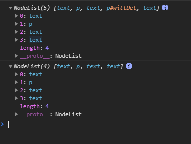
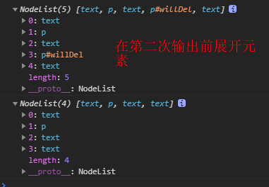

if(true) {
    var c =3333}
console.log(c)
-- 3333
c
3333
window.c
3333

###判断数组
1. 简单的检测--不可靠
```
function isArray(val) {
    return val && typeof val === 'object' && // 不为空
        val.constructer === Array // length 可枚举
}
```
2. 更可靠的检测方法。（但是这个方法会把arguments检测为数组）
```
function isArray(val) {
    return val && typeof val === 'object' && // 不为空
        typeof val.length === 'number' && // length 检测
        val.propertyisenumerable('length') // length 可枚举
}
```

3. 过滤arguments为数组--依据arguments不包含任何数组方法 `typeof val.slice === 'function'`
function isArray(val) {
    return val && typeof val === 'object' && // 不为空
        typeof val.length === 'number' && // length 检测
        val.propertyisenumerable('length') && // length 可枚举
        typeof val.slice === 'function' 
}

## 第六章：面向对象
### 
1. Object.defineProperty() - 一次只能一个属性
在定义访问器属性的时候：getter, setter, configurable, eumerable
如果只定义了getter, 则setter是不允许的，就是不能写，写入会被忽略，在严格模式下，会报错。没有指定getter的也不能读，读取会返回undefined
2.  Object.defineProperties() - 一次定义多个属性

第一个是对象，第二个是要定义的对象的属性的操作

### 6.2 创建对象
#### 1. 工厂模式
```
 function createPerson(name, age, job){
    var obj = new Object()
    obj.name = name
    obj.age = age
    obj.job = job
    obj.sayName = function (){
        alert(this.name)
    }
    return obj
}
```
**缺点：**
1. 没有解决对象识别的问题（即不知道对象是什么类型）

#### 2. 构造函数模式
```
function Person(name, age, job) {
    this.name = name
    this.age = age
    this.job = job
    this.sayName = function (){
        alert(this.name)
    }
}
```
**缺点：**
1. 对象内的方法不是同一个方法，每个实例方法都会重新创建一次    
解决： 可以将方法移动到构造函数。 但是在全局商定义函数只能被某个对象调用，又不符合全局函数的意义了

```
function Person(name, age, job) {
    this.name = name
    this.age = age
    this.job = job
    this.sayName = sayName
}
function sayName(){
    alert(this.name)
}
```

2. 当全局方法定义很多的时候，会使得构造函数的封装性毫无意义可言

可以使用原型模式构造函数


#### 3. 原型模式
```
function Person() {

}

Person.prototype.name = 'Pserson2 default name',
Person.prototype.age = 21,
Person.prototype.job = 'Software Engineer',
Person.prototype.sayName = function() {
    alert(this.name)
}
```
`hasOwnProperty(key)` 当实例上面存在有该属性时，就会返回true，实例上面不存在则返回false---这个方法只能判断实例上是否有某属性   

`name in obj` 则可以判断在原型或者实例上是否存在该属性----这个方法能判断实例或原型上是否有某属性

in 操作在能够访问属性操作时返回true
两者结合，可以判断原型上是否存在某个属性

```
function  hasProtoTypeProperty(object, name){
    return !object.hasOwnProperty(name) && (name in object)
}

```

`Object.keys(obj)` 返回对象的实例属性  ，就时某个实例定义过的属性，即使时覆盖的原型属性

**为了更好的封装原型的功能，会使用一个包含所有属性及方法的对象来覆盖原型**如下代码
```
function Person() {

}
Person.prototype = { 
    name: 'Pserson2 default name',
    age: 21,
    job: 'Software Engineer',
    sayName: function() {
        alert(this.name)
    }
}
```
这样的后果，使得`Person.prototype` 上的`constructor`丢失原来的指向，不会指向`Person`

改进：
```
Person.prototype = { 
    constructor: Person,  // 这样constructor 重新指向Person 
    name: 'Pserson2 default name',
    age: 21,
    job: 'Software Engineer',
    sayName: function() {
        alert(this.name)
    }
}
```
但是重设`constructor`方式带来的后果就是，使得`constructor`的特性`[[Enumerable]]` 被设置为`true`。正常情况下`constructor`的特性`[[Enumerable]]` 的值为`false`
**缺点：**
最大的问题是共享的本质，基本类型的属性没有影响。当属性值为引用类型的时候，因为时地址引用，修改某个对象的值，就会修改所有实例该属性的值。

所以就出现了 `组合使用构造函数模式和原型模式`

#### 4. 组合使用构造函数模式和原型模式

> 使用方法：
- 构造函数模式定义实例属性。

- 原型模式定义方法及共享的属性

这样，每个实例就会有自己的一份实例属性，但同时又共享着对方法的引用。

```
function Person() {
    this.name = 'Pserson2 default name',
    this.age = 21,
    this.job = 'Software Engineer',
}

Person.prototype.sayName = function() {
    alert(this.name)
}
```
**缺点：**

#### 5. 动态原型模式

```
function Person() {
    this.name = 'Pserson2 default name',
    this.age = 21,
    this.job = 'Software Engineer'

    if(typeof this.sayName != 'function') {
        Person.prototype.sayName = function() {
            alert(this.name)
        }
    }
}
```
**缺点：**   
> 不能使用对象字面量定义原型。
> 如果在已经创建了实例的情况下重写原型，就会切断现有实例跟原型之间的关系
#### 6. 寄生构造函数模式
```
function Person(name, age, job){
    var obj = new Object()
    obj.name = name
    obj.age = age
    obj.job = job
    obj.sayName = function (){
        alert(this.name)
    }
    return obj
}
```
**缺点：**


#### 7. 稳妥构造函数模式    

没有公共属性，而且其方法也不引用this的对象。

```
function Person(name, age, job){
    var obj = new Object()
    // 在这里定义私有变量和函数
    obj.sayName = function (){
        alert(name)
    }
    return obj
}
```

使用下面的方式调用构造函数：

```
var person = Person('Greg', 18, 'Software Engineer');
person.sayName(); // 'Greg'
```

**缺点：**


### 6.2 继承

#### 原型继承

```
function SuperType() {
    this.property = true
}

SuperType.prototype.getSuperValue = function() {
    return this.property
}


// 子类
function SubType() {
    this..subproperty = false
}

// 继承 
SubType.prototype = new Subtype()

SubType.prototype.getSubValue = function() {
    return this.subproperty
}

```

这样就实现了原型链继承。

**需要注意**

- 子类的原型方法，必须在原型继承之后。原型继承实际上是覆盖子类原型。

- 子类方法拓展不能使用字面量，因为会再次覆盖继承的原型。导致继承失效。

**缺点**
- 当在超类中`SuperType` 中加入一个引用类型的属性，则SubType的所有实例都引用同一个引用类型值，会造成引用类型共享。

#### 借用构造函数继承
```
 function SuperType( name= 'Greg') { // 默认值 es6写法
    this.name = name
    this.colors = ['red', 'blue']
    this.somFunc = function() {
        alert('somFunc')
    }
}
SuperType.prototype.sayName = function() {
    alert(this.name)
}

function SubType() {
    SuperType.call(this) //

    this.age = 18
}

SubType.prototype.sayAge = function() {
    alert(this.age)
}

var sub = new SubType()
sub.sayAge() // 18
sub.sayName() // 报错--Uncaught TypeError: sub.sayName is not a function
sub.somFunc()  // 'somFunc'
```
**特点**
1. **借用构造函数继承**，可以继承超类对象的属性，`（缺点）`但是不能继承超类对象原型中的属性及方法

2. **借用构造函数继承**方法，可以使超类的属性复制一份，各自拥有一份超类属性。

3. **借用构造函数继承**`可以传递参数`，在调用`SuperType.call(this)`的时候，比如
```
//....省略

function SubType() {
    SuperType.call(this, 'Customer Name')

    this.age = 18
}

```

4. `（缺点）`**借用构造函数继承** 方法只能在构造函数中定义。方法复用没有任何意义


#### 组合构造函数继承

**组合构造函数继承**,又叫伪经典继承，使将`原型链继承`与`借用构造函数继承`相结合的继承方式
```
// 超类
function SuperType(name = 'Greg') {
    this.name = name
    this.colors = ['red', 'blue']
}
SuperType.prototype.sayName = function(){
    alert(this.name)
}

// 子类
function SubType(name, age) {
    // 继承属性
    SuperType.call(this, 'Nick')

    // 定义子类的属性
    this.age = 18
}

// 继承方法
SubType.prototype = new SuperType()
// 定义子类 方法
SubType.prototype.sayAge = function () {
    alert(age)
}
```


## 第8章 BOM

定义全局变量，与在window上定义属性的差别：全局变量不能使用`delete`删除，window上的属性可以使用`delete`删除

```
var age = 29;
window.color = 'red';

delete window.age; // 返回false 在IE < 9的时候会直接抛出错误
delete window.color; // 返回true 在IE < 9的时候会直接抛出错误
```
因为`var `添加的属性将`[[Configurable]]`设置为`false`, 所以不能删除

- 窗口位置
```
screenTop(screenY--Firefox) 

screenLeft(screenX--Firefox)

// 移动窗口位置 -- 有可能被禁用，慎用
moveTo(x, y) // 移动至 坐标(x,y)
moveBy(x, y) // 在现有的基础上移动， 水平偏移x, 垂直偏移y

```

- 窗口大小

```
// 返回整个浏览器的大小
window.outerWidth
window.outerHeight

// 返回浏览器页面可视区的大小，假如开启debug模式，宽度变小
window.innerWidth
window.innerHeight

// 页面视口 信息
document.documentElement.clientWidth
document.documentElement.clientHeight

// IE6 混杂模式 页面视口 信息
document.body.clientWidth
document.body.clientHeight

// 调整窗口大小 -- 有可能被禁用，慎用
resizeTo(x, y) // 移动到坐标位置(x,y)
resizeBy(x, y) // X，Y坐标分别移动x,y大小
```

- 弹出窗口屏蔽检测
如果浏览器`内置`的屏蔽程序阻止的弹出窗口，那么window.open()很可能`返回null`。   
如果是`浏览器扩展`或`其他程序阻止`的弹出窗口，那么window.open()通常会`抛出一个错误`   

可以通过以下代码检测是哪种阻止弹出
```
var blocked = false
try {
    var wroxWin = window.open('http://xxx.com')
    if(wroxWin == null){
        blocked = true
        // 程序运行到此，说明是<浏览器内置>阻止的弹出窗口
    }
} catch (error) {
    blocked = true
    // 程序运行到此，说明是 <浏览器扩展>或<其他程序阻止>的弹出窗口
}

```


### location

查询字符串`location.search `  --"?key1=111&key2=222"
#### 获取字符串键值对   
>实现代码
```
function getQueryArgs() {
    var searchSrt = location.search.length ? location.search.substring(1) : "" // 截取从1开始的字符串
    var Args = {} // 存放query字符串
    var items = searchSrt.split('&') // 分隔字符串 'name=value'

    var item = null, name = null, value = null
    
    for(var i = 1, len = items.length; i < len; i++) {
        item = items[i].split('=') //
        name = item[0] // key
        value = item[1] // value
        if(name) { // name存在的情况下，将key-val 放入对象内
            Args[name] = value
        }
    }
    return Args
}
```
### navigator 

#### 插件-检测

非IE下才有navigator.plugins

所以非IE下插件的检测
```
// 非ie下插件检测
function hasPlugin(name) {
    var plugins = navigator.plugins || [];
    name = name.toLowerCase()
    for(var len = plugins.length, i = 0; i < len; i++) {
        if(plugins[i].name.toLowerCase().indexOf(name) > -1) {
            return true
        }
    }

    return false
}

// 检测Flas

alert(hasPlugin('Flash'))

```

IE下面的检测插件方法
```
// IE下面只能使用 ActiveXObject 来检测

function hasIEPlugin(name) {
    try {
        new ActiveXObject(name)
        return true
    } catch (error) {
        return false
    }
}

// 检测Flash
alert(hasIEPlugin('ShockwaveFlash.ShockwaveFlash'))

```
两个方法差异大，因此在使用的时候，要针对插件写特定的方法

比如：检测是否包含Flash
```
// 检测Flash
function hasFlash() {
    var result = hasPlugin('Flash');
    if(!result) {
        result = hasIEPlugin('ShockwaveFlash.ShockwaveFlash');
    }
    return result;
}
```

## 第9章 客户端检测

检测对象的某个属性是否存在
```
// 检测对象的某个属性是否存在
function isHostMethod(object, property) {
    var t = typeof object[property]

    return t == 'function' || 
        (!!(t == 'object' && object[property])) || 
        t == 'unknown' // IE ActiveXObject 属性 怪胎检测
}
```

## 第10章
someNode.childNodes 保存的是一个`NodeList`对象.    

`NodeList` 实际上是DOM结构动态执行查询的结果，因此DOM结构的变化能自动反应在`NodeList`之中。
> 即我们在第一次获取的`NodeList`并不是一成不变 ，当我们对DOM进行操作后，就会实时的反映在我们的`NodeList`中


```
<div id="test">
    <p>1111</p>
    <p id="willDel"></p>
</div>
<script>
    // console.log(document.getElementById('test') == document.body.childNodes[0])
    var div = document.getElementById('test')
    var divNodes = div.childNodes;
    console.log(divNodes)
    var ele = document.getElementById('willDel')
    setTimeout(function(){
        div.removeChild(document.getElementById('willDel'))
        ele.innerHTML = 'sssss'
        console.log(divNodes)
    }, 2000) 
</script>
```

在Chrome中，两次输出`divNodes`, 长度第一次是5，但是展开只有4个元素
第二次输出，长度是4展开确实有4个元素



但是假如在第二次结果输出前，展开第一次结果就会显示正确，

个人感觉是在控制台展开的时候才是真正读取元素的




-

任何DOM节点不能同时出现在同一个文档中。
比如，选中某个节点的第一个元素，将第一个元素appendChild()到最后一个元素中


DOM操作是JavaScript中开销最大的一部分


NodeList 对象都是动态的，每次访问NodeList都会执行一次查询，所以，减少DOM操作


为了消除空白字符对childNodes的影响， 添加了如下属性及方法
- childElementCount 非空白元素的个数
- firstElementChild 第一个非空白Node元素 firstChild的元素版
- lastElementChild 最后一个非空白节点的元素 lastChild的元素版
- previousElementSibling 上一个兄弟元素
- nextElementSibling 下一个兄弟元素