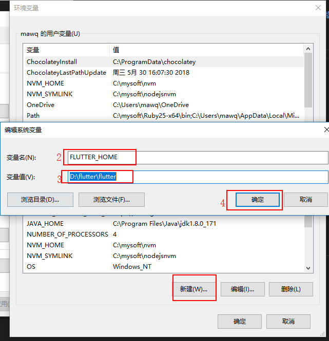

Flutter中文站:https://flutterchina.club/ --- 官网： https://flutter.io/   

Dart中文站：http://dart.goodev.org/

# windows10 环境搭建
## 1. 下载Flutter SDK
```
git clone -b beta https://github.com/flutter/flutter.git
```
**注意：Flutter的下载路径要全英文并且路径不能有空格！Flutter的下载路径要全英文并且路径不能有空格！Flutter的下载路径要全英文并且路径不能有空格！**
直接下载超慢，而且不停掉线，舍不得买代理FQ的童鞋，请配置镜像服务器地址，查看官方说明：
```
export PUB_HOSTED_URL=https://pub.flutter-io.cn
export FLUTTER_STORAGE_BASE_URL=https://storage.flutter-io.cn
```
这俩命令只支持mac和linux，在windows下加两个环境变量：
```
PUB_HOSTED_URL  https://pub.flutter-io.cn
FLUTTER_STORAGE_BASE_URL  https://storage.flutter-io.cn
```

## 2. 设置环境变量
我的电脑-> 属性-> 高级系统设置-> 环境变量-> 系统变量
添加`FLUTTER_HOME`



