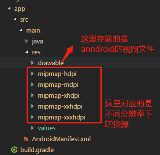

1. 基本介绍
2. 语言基础
3. 案例实现过程简单介绍
4. 采坑过程
5. 打包
6. 总结与对比其他语言的实现


## 一. 基本介绍
### 1.1 flutter中运行平台判断

### Dart

## 二. 案例实现
### 2.1 发布
#### 2.1.1 android发布
1. 给应用程序添加一个logo
> android: 

添加启动图标   
当一个新的Flutter应用程序被创建时，它有一个默认的启动器图标。要自定义此图标：

- 查看Android启动图标 设计指南，然后创建图标。

- 在<app dir>/android/app/src/main/res/目录中，将图标文件放入使用配置限定符命名的文件夹中。默认mipmap-文件夹演示正确的命名约定。

- 在AndroidManifest.xml中，将application标记的android:icon属性更新为引用上一步中的图标（例如  <application android:icon="@mipmap/ic_launcher" ...）。

- **注意res下面几个文件夹**：



要验证图标是否已被替换，请运行您的应用程序并检查应用图标

2. 添加一个首屏  

首屏是放在<app dir>/android/app/src/main/res/drawable目录中的launch_background.xml文件中的。

这个是运行时启动第一个屏

在里面做相应的布局，这里涉及到了android开发的layout布局文件
我们只做一个简单的修改：
```
<?xml version="1.0" encoding="utf-8"?>
<!-- Modify this file to customize your launch splash screen -->
<layer-list xmlns:android="http://schemas.android.com/apk/res/android">
    <item android:drawable="@color/colorPrimary" /> // color 可以在style中定义color颜色，具体案例查看<app dir>/android/app/src/main/res/values/colors.xml

    <!-- You can insert your own image assets here --> // 很明显了，这里可以修改添加自己的首屏图片及文字
    <item>
        <bitmap
            android:gravity="center"
            android:src="@mipmap/splash_logo" />
    </item>
</layer-list>

```

3. 添加一个过渡屏

#### 2.1.2 flutter 使用 iconfont
1. 直接使用   
https://blog.csdn.net/ZuoYueLiang/article/details/81475250

2. 通过python 转换，使用   
https://www.jianshu.com/p/1cfde18dc283

## Android 打包
按照文档一步一步来之后。

其中一个重要的环节是生成keystore,这个文件相当于证书。

出于开发方便，是放在项目中的（安全建议，单独管理）

出现的问题
### 采坑

```
$ flutter build apk
Initializing gradle...                                       0.9s
Resolving dependencies...                                    1.4s
Running 'gradlew assembleRelease'...

Error: java.util.concurrent.ExecutionException: com.android.builder.internal.aapt.v2.Aapt2Exception: AAPT2 error: check logs for detailsal.aapt.v2.Aapt2Exception: AAPT2 error: check logs for details
FAILURE: Build failed with an exception.

* What went wrong:
Execution failed for task ':app:mergeReleaseResources'.
> Error: java.util.concurrent.ExecutionException: com.android.builder.internal.aapt.v2.Aapt2Exception: AAPT2 error: check logs for details
* Try:
Run with --stacktrace option to get the stack trace. Run with --info or --debug option to get more log output. Run with --scan to get full insights.
* Get more help at https://help.gradle.org

BUILD FAILED in 4s                                                                                                                                 Gradle build failed: 1
```
原因： ？？？

解决方法：[原文](https://blog.csdn.net/lyh1299259684/article/details/80319136)

**问题：Error:java.util.concurrent.ExecutionException: com.android.builder.internal.aapt.AaptException:**

这个问题一般会在打包的时候遇到，查阅了网上很多资料都是说因为项目路径过长原因导致，但是其实很多时候并不是的，其主要原因是builde.gradle会在你打包的时候去检查你的res资源，一旦出现不规范就会出现该错误。

以上是问题所在，解决方案：

当然解决方案就是我们主动去禁止它检查，即在你Module的builde.gradle中添加以下代码：
```
android{
  .....
  aaptOptions.cruncherEnabled = false
  aaptOptions.useNewCruncher = false
  .....
}
````

采坑2   
### [ERROR:flutter/shell/gpu/gpu_surface_gl.cc(55)] Failed to setup Skia Gr context.

[解决方法: https://github.com/flutter/flutter/issues/9108](https://github.com/flutter/flutter/issues/9108) 


检查了CLI参数并尝试flutter run --enable-software-rendering，这应该强制软件渲染，对吧？这摆脱了Skia Gr上下文错误，但应用程序仍然只在模拟器中呈现纯黑色屏幕。我可以收集任何其他信息以帮助继续调试吗？