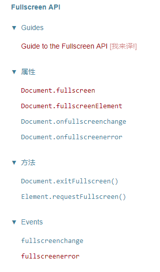

# 网页全屏
参考文章：https://juejin.im/post/5c024ea951882548e937f6f5

参考MDN-[全屏 API : https://developer.mozilla.org/zh-CN/docs/Web/API/Fullscreen_API](https://developer.mozilla.org/zh-CN/docs/Web/API/Fullscreen_API)

// 参考整理--examples/html/full_screen/index.html


## 演示地址
[codePen-demo](https://codepen.io/sansanshow/pen/oQRyBZ)
[fullScreen.js](../../../master/examples/html/full_screen/fullScreen.js)


## API解读


总共用到6个API：

1. 浏览器是否支持全屏模式：document.fullscreenEnabled
2. 使元素进入全屏模式：Element.requestFullscreen()
3. 退出全屏：document.exitFullscreen()
4. 检查当前是否有节点处于全屏状态：document.fullscreenElement
5. 进入全屏/离开全屏，触发事件：document.fullscreenchange
6. 无法进入全屏时触发: document.fullscreenerror

## 是否支持全屏-fullscreenEnabled
```
/**
   * 判断是否支持全屏
   * @param {*} fn 
   */
function isFullScreen(fn, succ) {
  let fullScreenEnabled;
  if (document.fullscreenEnabled) {
    fullScreenEnabled = true;
    this.prefixName = '';
  } else if (document.webkitFullscreenEnabled) {
    fullScreenEnabled = true;
    this.prefixName = 'webkit';
  } else if (document.mozFullscreenEnabled) {
    fullScreenEnabled = true;
    this.prefixName = 'moz';
  } else if (document.msFullscreenEnabled) {
    fullScreenEnabled = true;
    this.prefixName = 'ms';
  }
  if (!fullScreenEnabled) {
    this.isEnabledFullScreen = false;
    fn && fn();
  } else {
    succ && succ();
  }
}
```

## #事件
### >fullscreenchange
当成功进入全屏模式时，包含该元素的文档会收到一个 fullscreenchange 事件。当退出全屏模式时，文档会再一次收到  fullscreenchange 事件。注意此 fullscreenchange 事件本身，不管在文档进入和退出全屏模式时，都不会提供任何信息，但如果文档有一个非空的 fullscreenElement，你就可以得知你处于全屏模式中。

### >fullscreenerror
并不保证你总是可以进入全屏模式。例如 `<iframe>` 元素具有 allowfullscreen 属性，可选择是否将其内容以全屏模式显示。另外，几种特定的内容，比如窗体插件，不能以全屏模式显示。尝试将不能以全屏模式显示的元素 (或者此元素的父元素和后代元素)全屏显示是无效的。而要求全屏显示的元素会收到一个 mozfullscreenerror 事件。当全屏请求失败时，Firefox 会在Web控制台上记录一条错误信息解释请求为什么失败。但是在 Chrome 和新版的 Opera中，不会生成这样的警告。

> 注意: 全屏请求必须在事件处理函数中调用，否则将会被拒绝。

## #属性方法
## >进入全屏模式-requestFullscreen
进入全屏模式-使用`requestFullscreen`.

是vedio元素进入全屏
```
<video controls id="myvideo">
  <source src="somevideo.webm"></source>
  <source src="somevideo.mp4"></source>
</video>
```
添加点击事件：
```
var elem = document.getElementById('myvideo');
elem.addEventListener('click', function() {
  if (elem.requestFullscreen) {
    elem.requestFullscreen();
  } else if (elem.msRequestFullscreen) {
    elem.msRequestFullscreen();
  } else if (elem.mozRequestFullScreen) {
    elem.mozRequestFullScreen();
  } else if (elem.webkitRequestFullscreen) {
    elem.webkitRequestFullscreen();
  }
});
```
由于各浏览器的实现不同，需要找到相应的前缀方法请求

## >退出全屏模式-exitFullscreen

直接调用`document.exitFullscreen()`退出全屏。

## >document.mozFullScreen
非标准方法。
返回一个布尔值,表明当前文档是否处于全屏模式.
```
var isFullScreen = document.mozFullScreen || document.webkitIsFullScreen;
```
ex:
```
function isDocumentInFullScreenMode() {
  // 过去由F11触发的那种浏览器全屏模式和HTML5中内容的全屏模式是不一样的
  return (document.fullScreenElement && document.fullScreenElement !== null) ||    
      (!document.mozFullScreen && !document.webkitIsFullScreen);                 
}
```

## >是否有全屏元素fullscreenElement
```
var element = document.fullscreenElement;
```
判断完整方法：
```
/**
  * 判断是否有元素在全屏下
  */

function hasElementFullScreen() {
  const fullscreenElement = document.fullscreenElement ||
    document.msFullscreenElement ||
    document.mozFullscreenElement ||
    document.webkitFullscreenElement;
    if (fullscreenElement) {
      return true;
    }
    return false;
}
```