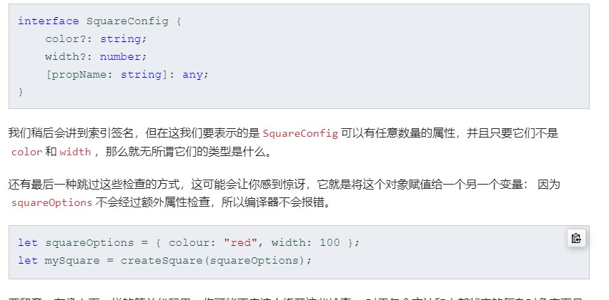

## 接口
## 可选属性
```
interface SquareConfig {
  color?: string;
  width?: number;
}

function createSquare2(config: SquareConfig): { color: string, area: number } {
  let defSquare = { color: 'white', area: 100 };
  if (config.color) {
    defSquare.color = config.color;
  }

  if (config.width) {
    defSquare.area = config.width * config.width;
  }
  return defSquare;
}

```
1： ex1
**如下代码**：  
```
let mySquare = createSquare({color: 'black', width: 12});
```
这种情况下 可以没有任何属性， 但是不能有不匹配的属性名

假如有 `一个` 错误的属性出现都会报错, 如下代码就会报错
```
// 1: Error:
/**
Argument of type '{ color: string; width: number; otherProp: number; }' is not assignable to parameter of type 'SquareConfig'.
  Object literal may only specify known properties, and 'otherProp' does not exist in type 'SquareConfig'.
*/
let mySquare = createSquare({color: 'black', width: 12, otherProp: 111});

// 2: Error

```
文档上说 通过 一个对象可以绕过检查


下面的这种时没问题的
```
// 1：OK
let paramX = {color: 'black', otherProp: 'xxx'}
let mySquare= createSquare(paramX);
```

但是下面的就不会验证通过， 注意两个属性都不正确 colour(正确的应该是color) 
```
// 1：
let paramX = {colour: 'black', otherProp: 'xxx'}
let mySquare= createSquare(paramX);
```
#### 即使时要绕过，必须要有一个及以上属性 正确

加上任意属性的 定义后，就不会出现此类问题

```
interface SquareConfig {
  color?: string;
  width?: number;
  [propName: string]: any;
}

//Ok
let paramX1 = {color: 'black', otherProp: 'xxx'}
let mySquare= createSquare(paramX1);

// OK
let paramX = {colour: 'black', otherProp: 'xxx'}
let mySquare2= createSquare(paramX);

// OK
let mySquare = createSquare({color: 'black', width: 12, otherProp: 111});

```